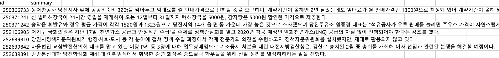
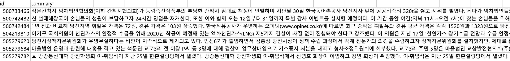

# dacon-ko-abstract-extract
데이콘 한국어 문서 추출 및 생성요약 AI 경진대회 정리
## 대회 목표
다양한 주제의 한국어 원문으로부터 추출요약문과 생성요약문을 도출해낼 수 있도록 인공지능을 개발

## 데이터 
### jsonl
jsonl 파일은 Json Line 형식의 파일로, 한줄에 json 객체 하나로 되어 있는 파일 형식을 말한다. 

#### 학습 데이터
###### train.jsonl
- media : 기사 미디어
- id : 각 데이터 고유 번호
- article_original : 전체 기사 내용, 문장별로 split. 
    + 최대 길이는 97
    + 평균 길이는 13
    + 최대 토큰 길이
        * kobert tokenizer max length: 1250
        * kogpt tokenizer max length: 1029  
- abstractive : 사람이 생성한 요약문. 최대 토큰 길이 213. koGPT2 기준
- extractive : 사람이 추출한 요약문 3개의 index
#### 테스트 데이터
`abstractive_test_v2.jsonl`,`extractive_test_v2.jsonl`

#### 제출 데이터
xxxx_test_v2.json의 추론결과를 csv 파일로 제출

## 생성요약 (Abstrative)
원문을 바탕으로 요약문을 생성하는 요약방법
- KoGPT2의 max_len = 1024

### 데이터
원문과 요약문을 1024 토큰에 맞춰서 자르고, 학습
```
<s> 원문 </s> 요약문 </s>
```
### 학습
kogpt2-transformers 패키지를 이용하여, KoGPT-2 학습. 
```python
class AbstractiveKoGPT2(nn.Module):
  def __init__(self):
    super(AbstractiveKoGPT2, self).__init__()
    self.kogpt2 = get_kogpt2_model()

  def generate(self,
               input_ids,
               do_sample=True,
               max_length= 60,
               top_p=0.92,
               top_k=50,
               temperature= 0.6,
               no_repeat_ngram_size =None,
               num_return_sequences=3,
               early_stopping=False,
               ):
    return self.kogpt2.generate(input_ids,
               do_sample=do_sample,
               max_length=max_length,
               top_p = top_p,
               top_k=top_k,
               temperature=temperature,
               no_repeat_ngram_size= no_repeat_ngram_size,
               num_return_sequences=num_return_sequences,
               early_stopping = early_stopping,
               eos_token_id = 1,
               pad_token_id= 3
              )

  def forward(self, input, labels = None):
    if labels is not None:
      outputs = self.kogpt2(input, labels=labels)
    else:
      outputs = self.kogpt2(input)

    return outputs
```

## 결과


## 추출요약 (Extrative)
원문에서 요약할 문장을 추출하여 요약하는 방법.
- KoBERT의 max_len = 512

### 데이터
추출될 토큰과 추출되지 않을 토큰에 대해 1과 0으로 라벨링 하여 학습  
**예시**  
```txt
{
  "input_ids": [2, 1618, 7344, 6705, 2132, 5476, 5468, 6116, 1652, 4930, 5030, 6493,...],
  "token_type_ids": [1, 1, 1, 1, 1, 1, 1, 1, 1, 1, 1, 1, 1, 1, 1, 0, 0, 0, 0, 0, 0, 0, 0, 0, ...],
  "attention_mask": [1, 1, 1, 1, 1, 1, 1, 1, 1, 1, 1, 1, 1, 1, 1, 1, 1, 1, 1, 1, 1, 1, 0, 0],
  "labels": [1, 1, 1, 1, 1, 1, 1, 1, 1, 1, 1, 1, 1, 1, 1, 0, 0, 0, 0, 0, 0, 0, 0, 0, ...]
}
```

### 모델
NER에서 토큰별 라벨을 분류하는 방법과 같이, `추출될문장 1`과 `추출되지 않을 문장 0`으로 나누어 학습. 
```python
class KoBERTforExtractiveSummarization(BertPreTrainedModel):
  def __init__(self,
                num_labels = 2,
                hidden_size = 768,
                hidden_dropout_prob = 0.1,
               ):
    super().__init__(get_kobert_config())

    self.num_labels = num_labels
    self.kobert = get_kobert_model()
    self.dropout = nn.Dropout(hidden_dropout_prob)
    self.ffn = nn.Linear(hidden_size, 4*hidden_size)
    self.classifier = nn.Linear(4*hidden_size, num_labels)

    self.init_weights()

  def forward(
          self,
          input_ids=None,
          attention_mask=None,
          token_type_ids=None,
          position_ids=None,
          head_mask=None,
          inputs_embeds=None,
          labels=None
  ):
    outputs = self.kobert(
      input_ids,
      attention_mask=attention_mask,
      token_type_ids=token_type_ids,
      position_ids=position_ids,
      head_mask=head_mask,
      inputs_embeds=inputs_embeds,
    )

    sequence_output = outputs[0]

    sequence_output = self.dropout(sequence_output)
    sequence_output = self.ffn(sequence_output)
    logits = self.classifier(sequence_output)

    loss = None
    if labels is not None:
      loss_fct = CrossEntropyLoss()#reduction='sum') # reduction mean makes loss small
      # Only keep active parts of the loss
      if attention_mask is not None:
        active_loss = attention_mask.view(-1) == 1
        active_logits = logits.view(-1, self.num_labels)
        active_labels = torch.where(
          active_loss, labels.view(-1), torch.tensor(loss_fct.ignore_index).type_as(labels)
        )
        loss = loss_fct(active_logits, active_labels)
      else:
        loss = loss_fct(logits.view(-1, self.num_labels), labels.view(-1))

    return_data ={
      'loss':loss,
      'logits':logits
    }
    return return_data # (loss), logits, (hidden_states), (attentions)
```
## 결과
